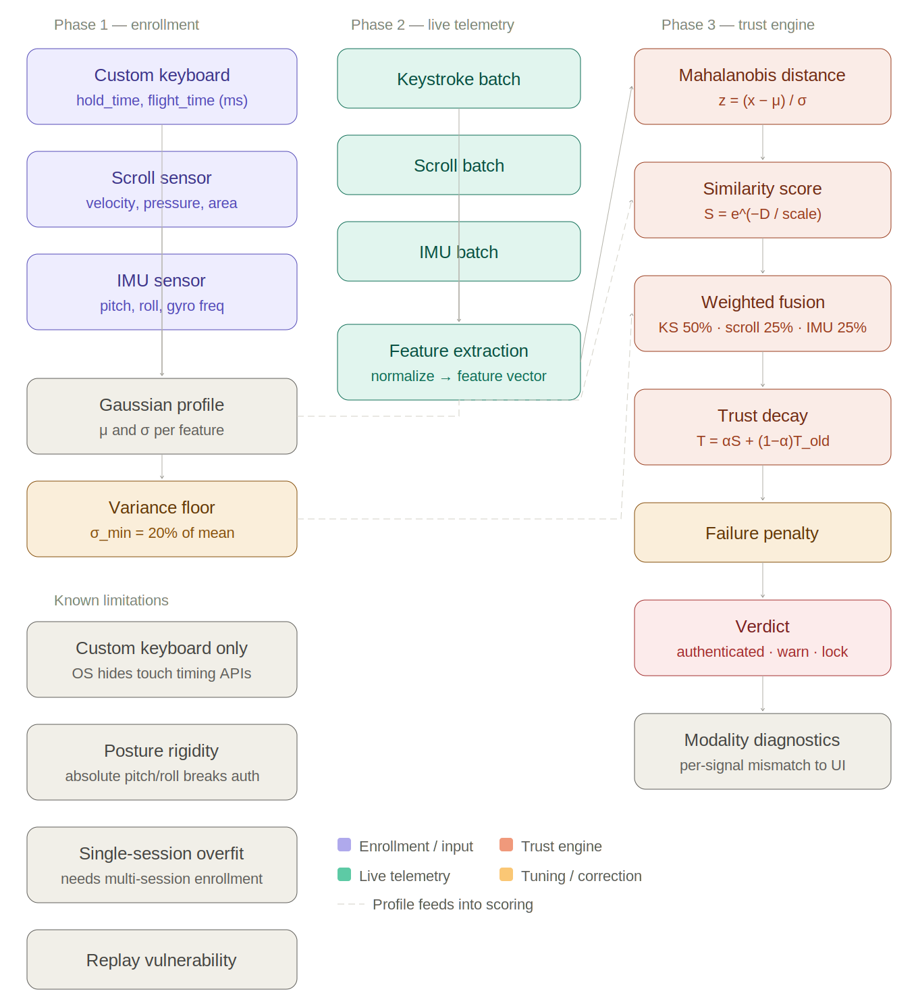

# TrueCred

TrueCred keeps watching who is actually using the phone after login. It tracks touch patterns, scrolling, and how you hold the device, then compares that to a profile from enrollment. If someone else takes over an unlocked session, the trust score drops and the app locks before anything sensitive goes through.

Built by Team Brothers: Utkrist Mani Neupane, Saksham Gyawali, Sammit Poudyal, Nishant Pandit.

## The problem

Most apps stop checking identity once you log in. That leaves a real gap:

- Passwords and OTPs do not help if the phone gets snatched while unlocked.
- Remote access trojans and device takeover attacks can run inside an already-authenticated session.
- Financial apps lose trust fast after unauthorized transfers.

TrueCred protects the session itself, not just the login screen.

## How it works



The system runs in three phases (see `truecred_system_architecture.svg` for the full diagram):

**Phase 1: Enrollment.** The user scrolls, types fixed phrases on a custom keyboard, and holds the phone normally. Keystroke timing, scroll dynamics, and IMU readings get stored as a Gaussian profile (mean and variance per feature).

**Phase 2: Live telemetry.** While the app is open, touch data, scroll events, and gyroscope samples are batched every 15 seconds and sent to the backend for feature extraction.

**Phase 3: Trust engine.** Live features are scored against the enrolled profile using Mahalanobis distance, fused across keystroke (50%), scroll (25%), and IMU (25%) signals, then smoothed into a trust score. If behavior diverges enough, the app locks and asks for the password again.

Critical actions like sending money or reviewing a transaction are where the strictest checks happen. Same idea as the presentation in `final/index.html`.

## Project structure

```
TrueCred/
├── expo/                 React Native mobile app (Expo)
├── fastapiCollector/     Backend API and biometric scoring engine
├── lstm/ml_pipeline/     LSTM model training and ONNX export
├── final/                Presentation site (index.html) and demo videos
└── verify_db.py          Quick SQLite sanity check script
```

| Component | Role |
|-----------|------|
| `expo/` | Collects sensor and touch data, runs enrollment, polls `/verify`, locks on low trust |
| `fastapiCollector/` | User accounts, enrollment storage, Gaussian + LSTM verification, SQLite |
| `lstm/ml_pipeline/` | Train the behavioral LSTM, export ONNX weights, optional standalone API |
| `final/` | Slide deck and demo recordings |

## Getting started

You need Python 3.10+, Node.js, and the Expo CLI. Start the backend first, then point the mobile app at it.

### 1. Backend

```bash
cd fastapiCollector
python -m venv .venv
source .venv/bin/activate   # Windows: .venv\Scripts\activate
pip install -r requirements.txt
uvicorn main:app --host 0.0.0.0 --port 8000 --reload
```

The API listens on port 8000. SQLite database file `sentinel_lab.db` is created in `fastapiCollector/`.

### 2. Mobile app

```bash
cd expo
npm install
```

Set the backend URL in `expo/config.js` or via environment variable:

```bash
export EXPO_PUBLIC_API_BASE_URL=http://YOUR_MACHINE_IP:8000
npx expo start
```

Use Expo Go on a physical device for IMU and touch sensors. When testing on a phone, point `API_BASE_URL` at your machine's LAN address, not `localhost`.

### 3. LSTM pipeline (optional)

The backend works out of the box with the Gaussian engine. To train and deploy the LSTM fallback:

```bash
cd lstm/ml_pipeline
pip install -r requirements.txt
python reset_db.py
python data_loader.py
python train.py
python export_onnx.py
```

Export writes `sentinel_encoder.onnx` in `lstm/ml_pipeline/`. Copy it to `checkpoints/sentinel_lstm.onnx`, then restart the backend.

See [lstm/ml_pipeline/README.md](lstm/ml_pipeline/README.md) for details.

## API overview

| Method | Path | Purpose |
|--------|------|---------|
| GET | `/health` | Service status |
| POST | `/users/create` | Register account |
| POST | `/users/login` | Authenticate |
| POST | `/enroll` | Submit behavioral enrollment data |
| POST | `/verify` | Compare live behavior against profile |
| GET | `/user/{user_id}/profile` | Inspect stored biometric profile |

Full request/response shapes are in `fastapiCollector/schemas.py`.

## Trust levels

The Gaussian engine returns a continuous trust score. The mobile app maps it to states:

| Score | State | App behavior |
|-------|-------|--------------|
| 0.65 and above | Verified | Normal use |
| 0.40 to 0.64 | Monitoring | Elevated watch |
| 0.28 to 0.39 | Suspicious | Step-up auth likely |
| Below 0.28 | Locked | Screen lock, password required |

Thresholds are configurable in `fastapiCollector/config.py` and `expo/config.js`.

## Known limitations

These are called out in the architecture diagram and worth keeping in mind:

- Keystroke capture only works through the custom in-app keyboard. The OS hides touch timing APIs from native keyboards.
- IMU scoring assumes a similar phone posture. Big changes in pitch/roll can look like an impostor.
- Single-session enrollment can overfit. Multi-session enrollment would be more robust.
- Replay attacks (replaying recorded touch data) are not fully defended against yet.

## Presentation

Open `final/index.html` in a browser for the full slide deck, demo video player, and references. It walks through the problem, solution, pipeline, and live demo scenarios (normal user vs simulated attack).

## References

- [Touchalytics](https://arxiv.org/pdf/1207.6231) (touch dynamics on smartphones)
- [ProKYC](https://www.catonetworks.com/blog/prokyc-selling-deepfake-tool-for-account-fraud-attacks/) (deepfake KYC fraud tooling)
- [BingoMod](https://www.cleafy.com/cleafy-labs/bingomod-the-new-android-rat-that-steals-money-and-wipes-data) (Android RAT targeting financial apps)
- [FBI IC3 Annual Report 2024](https://www.ic3.gov/AnnualReport/Reports/2024_IC3Report.pdf)
